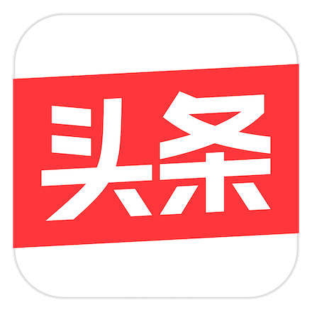

<div align="center">
    <h1>Scene</h1>
    <p>TikTok Single Activity Framework.</p>
    <p>English&nbsp;&nbsp;|&nbsp;&nbsp;
    <a target="_blank" href="https://github.com/bytedance/scene/blob/master/README_cn.md">简体中文</a>&nbsp;&nbsp;|&nbsp;&nbsp;
    <a target="_blank" href="https://github.com/bytedance/scene/blob/main/README_ja.md">日本語</a>&nbsp;&nbsp;
    <br/>
</div>


[](https://github.com/bytedance/scene/blob/master/LICENSE) 
[](https://jitpack.io/#bytedance/scene)
[](https://developer.android.com/about/dashboards)

**Scene** is a lightweight library of navigation and ui composition based on view.

- [x] Compatible with Fragment framework
- [x] Simple navigation stack management, support multi-navigation-stack
- [x] Improved lifecycle management and distribution
- [x] Easier to implement complex cross-page and shared-element animation
- [x] Supports modification and automatic restoration of Activity and Window properties
- [x] Support exchange data between Scenes, support request and grant permissions in Scene
- [x] Support save and recovery parcable state of Scene
- [x] No R8 / Proguard configuration required

[Download the latest Sample APK](https://github.com/bytedance/scene/blob/readme/misc/latest_sample.apk)

Introduction
-------------
Scene is designed to replace the use of Activity and Fragment on navigation and page segmentation.

The main problems of **Activity**:
1. The stack management of Activity is weak, Intent and LaunchMode are confusing, even if various of hacks still can't completely avoid issues like black screen 
2. The performance of Activity is poor, average startup time of an empty Activity is more than 60ms (on Samsung S9)
3. Because the Activity is forced to support states recovery, it causes some problems:
    - Transition animation has limited ability, difficult to implement complex interactive animations.
    - Shared-element animation is basically unavailable, and there are some crashes unresolved in Android Framework.
    - Every time starting a new Activity, onSaveInstance() of the previous Activity must be executed completely first, which will lose much performance.
4. Activity relies on the Manifest file to cause injection difficulties, which also result in that Activity dynamics requires a variety of hacks

The main problems of **Fragment**:
1. [Google Navigation Component](https://developer.android.com/guide/navigation) will destory Fragment' view when it is invisible
2. There are many crashes that the Google official can't solve for a long time. Even if you don't use Fragment, it may still trigger a crash in the OnBackPressed() of AppCompatActivity.
3. The add/remove/hide/show operation is not executed immediately. With nest Fragments even if you use commitNow(), the status update of the sub Fragments cannot be guaranteed.

The Scene framework tries to solve these problems of the Activity and Fragment mentioned above.

Provides a simple, reliable, and extensible API for a lightweight navigation and page segmentation solution

At the same time, we provide a series of migration solutions to help developers gradually migrate from Activity and Fragment to Scene.

Get Started
-------------
Add it to your root build.gradle at the end of repositories:
```gradle
//build.gradle
allprojects {
	repositories {
		...
		maven { url 'https://jitpack.io' }
	}
}
```

```kotlin
//or settings.gradle.kts
dependencyResolutionManagement {
    repositoriesMode.set(RepositoriesMode.FAIL_ON_PROJECT_REPOS)
    repositories {
        ...
        maven { url = uri("https://jitpack.io") }
    }
}
```

Add it to your build.gradle, [latest_version](https://github.com/bytedance/scene/releases) :
```gradle
dependencies {
	implementation 'com.github.bytedance:scene:$latest_version'
        //or
	implementation 'com.github.bytedance.scene:scene:$latest_version'
	implementation 'com.github.bytedance.scene:scene_navigation:$latest_version'
	implementation 'com.github.bytedance.scene:scene_ui:$latest_version'
	implementation 'com.github.bytedance.scene:scene_dialog:$latest_version'
	implementation 'com.github.bytedance.scene:scene_shared_element_animation:$latest_version'
	implementation 'com.github.bytedance.scene:scene_ktx:$latest_version'
}
```

```kotlin
//or build.gradle.kts
dependencies {
    implementation ("com.github.bytedance:scene:$latest_version")
    //or
    implementation ("com.github.bytedance.scene:scene:$latest_version")
    implementation ("com.github.bytedance.scene:scene_navigation:$latest_version")
    implementation ("com.github.bytedance.scene:scene_ui:$latest_version")
    implementation ("com.github.bytedance.scene:scene_dialog:$latest_version")
    implementation ("com.github.bytedance.scene:scene_shared_element_animation:$latest_version")
    implementation ("com.github.bytedance.scene:scene_ktx:$latest_version")
}
```

For simple usage, just let your Activity inherit from SceneActivity:

```kotlin
class MainActivity : SceneActivity() {
    override fun getHomeSceneClass(): Class<out Scene> {
        return MainScene::class.java
    }

    override fun supportRestore(): Boolean {
        return false
    }
}
```

A simple Scene example:

```kotlin
class MainScene : AppCompatScene() {
    private lateinit var mButton: Button
    override fun onCreateContentView(inflater: LayoutInflater, container: ViewGroup, savedInstanceState: Bundle?): View? {
        val frameLayout = FrameLayout(requireSceneContext())
        mButton = Button(requireSceneContext())
        mButton.text = "Click"
        frameLayout.addView(mButton, FrameLayout.LayoutParams(ViewGroup.LayoutParams.WRAP_CONTENT, ViewGroup.LayoutParams.WRAP_CONTENT))
        return frameLayout
    }

    override fun onActivityCreated(savedInstanceState: Bundle?) {
        super.onActivityCreated(savedInstanceState)
        setTitle("Main")
        toolbar?.navigationIcon = null
        mButton.setOnClickListener {
            navigationScene?.push(SecondScene())
        }
    }
}

class SecondScene : AppCompatScene() {
    private val mId: Int by lazy { View.generateViewId() }

    override fun onCreateContentView(inflater: LayoutInflater, container: ViewGroup, savedInstanceState: Bundle?): View? {
        val frameLayout = FrameLayout(requireSceneContext())
        frameLayout.id = mId
        return frameLayout
    }

    override fun onActivityCreated(savedInstanceState: Bundle?) {
        super.onActivityCreated(savedInstanceState)
        setTitle("Second")
        add(mId, ChildScene(), "TAG")
    }
}

class ChildScene : Scene() {
    override fun onCreateView(inflater: LayoutInflater, container: ViewGroup, savedInstanceState: Bundle?): View {
        val view = View(requireSceneContext())
        view.setBackgroundColor(Color.GREEN)
        return view
    }
}
```

Fragment
-------------
copy [FragmentScene](https://github.com/bytedance/scene/wiki/Scene-load-Fragment) to your project 

```kotlin
class YourFragment : Fragment() {
    override fun onCreateView(
        inflater: LayoutInflater, container: ViewGroup?, savedInstanceState: Bundle?
    ): View {
        return View(requireContext())
    }

    override fun onActivityCreated(savedInstanceState: Bundle?) {
        super.onActivityCreated(savedInstanceState)
        val parentScene = ViewUtlity.findScene(this.view()) as YourFragmentScene
    }
}

class YourFragmentScene : FragmentScene() {
    override val fragmentClass = YourFragment::class.java
}
```

Compose
-------------
https://github.com/bytedance/scene/wiki/Compose

Sample
--------
Scene sample is built using Gradle. On Linux, simply run:

    ./gradlew installDebug

Document
-------------
https://github.com/bytedance/scene/wiki

Issues
-------------
### Dialog

A normal Dialog's Window is independent and in front of the Activity's Window,
so if try to push a Scene in a opening Dialog, it will cause the Scene to appear behind it. 
You can close the dialog box when click, or use transparent Scene to implement the dialog instead of a system Dialog.


Apps using Scene
-------------
| |  |  |  |
|:-----------:|:-------:|:-------:|:-------:|
| TikTok | Douyin | Xigua Video |  Toutiao |


## License
~~~
Copyright (c) 2019 ByteDance Inc

Licensed under the Apache License, Version 2.0 (the "License");
you may not use this file except in compliance with the License.
You may obtain a copy of the License at

   http://www.apache.org/licenses/LICENSE-2.0

Unless required by applicable law or agreed to in writing, software
distributed under the License is distributed on an "AS IS" BASIS,
WITHOUT WARRANTIES OR CONDITIONS OF ANY KIND, either express or implied.
See the License for the specific language governing permissions and
limitations under the License.
~~~
